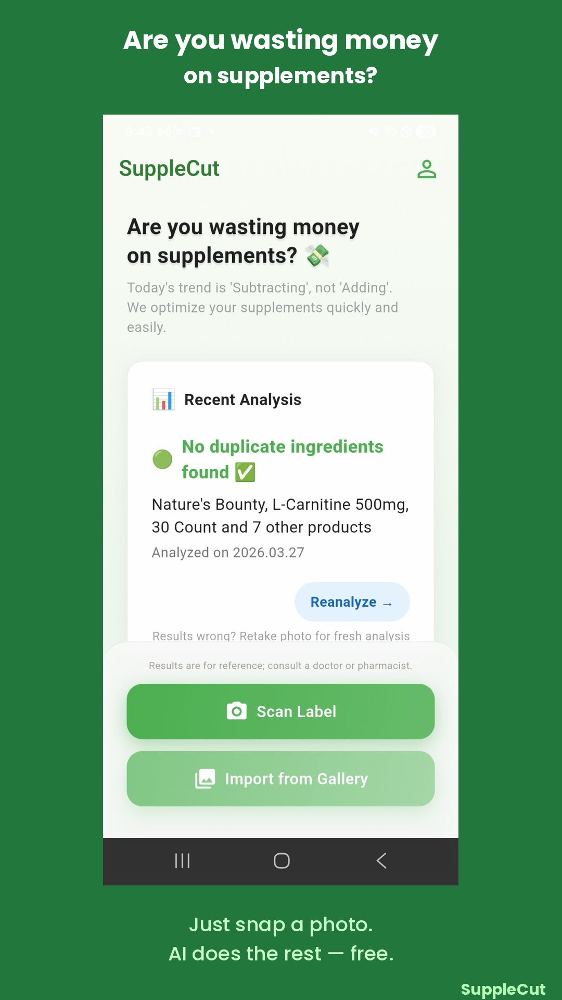
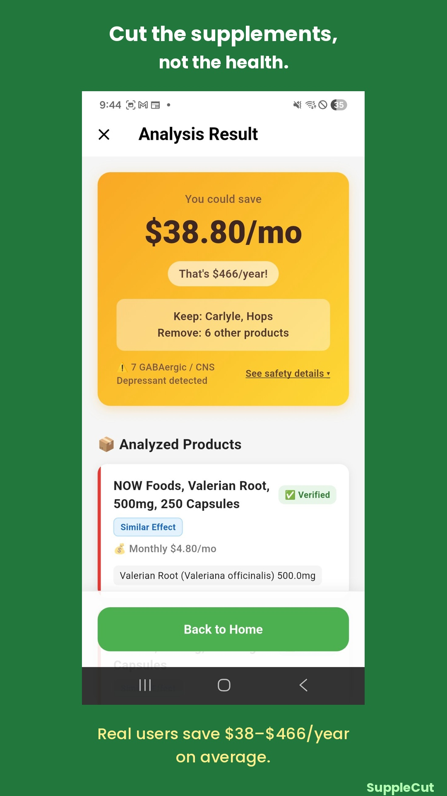
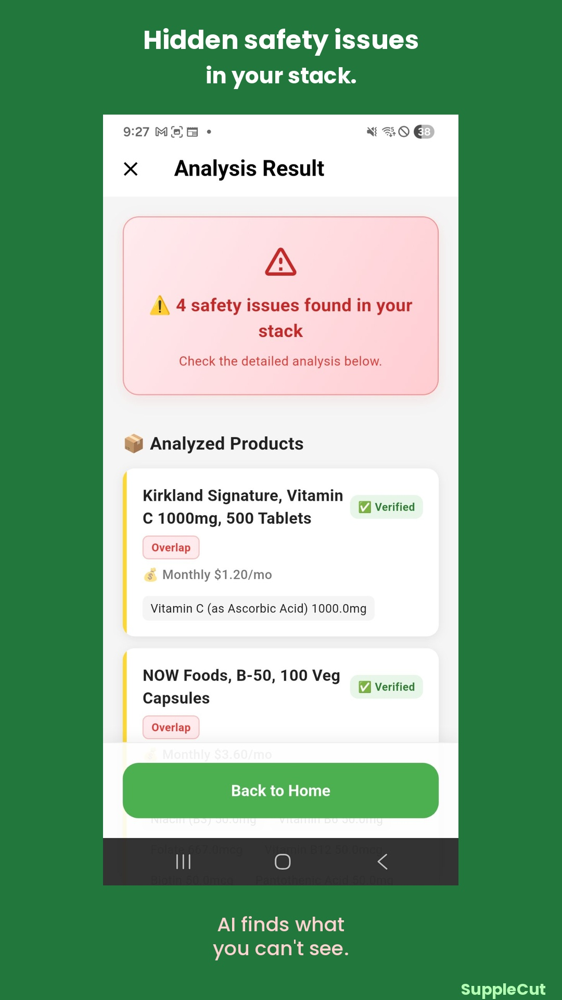
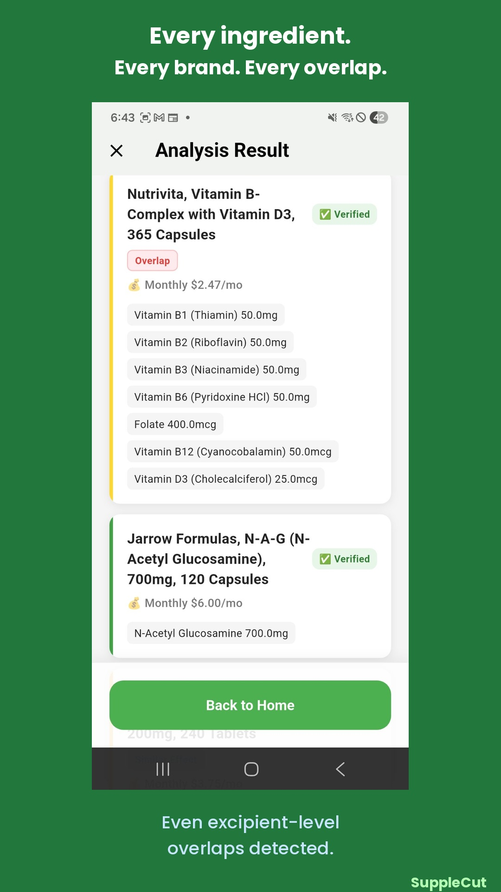

# SuppleCut (약비서) — AI 영양제 스택 분석기


> **영양제를 스캔하세요. 중복을 찾으세요. 낭비를 줄이세요. 돈을 아끼세요.**

[🇺🇸 English](README.md)

---

## 문제

미국인 평균 **하루 4개 이상의 영양제**를 복용하며, 월 **$56**을 지출합니다. 대부분 자신의 영양제 스택에 중복 성분이 있다는 사실을 모르고 — 때로는 안전 상한섭취량(UL)을 초과하기도 합니다.

심지어 약사도 **Dicalcium Phosphate**(정제 부형제에 숨겨진 칼슘) 같은 비활성 성분 속 중복을 놓칠 수 있습니다.

## 솔루션

**SuppleCut**은 영양제 사진을 찍으면 AI 비전으로 모든 제품을 식별하고, 전체 스택을 분석합니다:

- 🔴 **성분 중복** — 여러 제품에서 같은 영양소가 UL 초과
- 🟡 **기전 충돌** — GABAergic, 안드로겐, 혈액 희석 경로 중복
- ⚡ **UL 초과** — 단일 제품 또는 교차 제품 상한섭취량 위반
- ⚕️ **약물 상호작용** — 스타틴 동등 성분(Red Yeast Rice), 갑상선 충돌 등
- 💰 **비용 최적화** — 어떤 영양제를 빼야 하는지, 월간/연간 절감액 제공

| | | | |
|:---:|:---:|:---:|:---:|
|  |  |  |  |

## 아키텍처

```
📸 사진 입력
    │
    ▼
┌─────────────────────────────────┐
│  Gemini Flash (무료 분석)        │
│  ─────────────────────────────  │
│  • Vision OCR → 제품 식별       │
│  • 성분 파싱                     │
│  • 중복 감지                     │
│  • 기전 분석                     │
│  • UL 계산                       │
│  • 제외 추천                     │
│  • 절감액 계산                   │
│  → overall_status (🟢🟡🔴)     │
└──────────────┬──────────────────┘
               │
    ┌──────────┴──────────┐
    ▼                     ▼
┌────────────┐    ┌────────────────────┐
│  앱 UI     │    │  Claude Sonnet     │
│  (무료)     │    │  ($1.99 인앱결제)   │
│            │    │  ────────────────  │
│  신호등 UX  │    │  5섹션 상세 리포트   │
│  🟢🟡🔴    │    │  • 스택 개요        │
│            │    │  • 중복 & UL 체크   │
│            │    │  • 안전성 경고      │
│            │    │  • 제거 추천        │
│            │    │  • 복용 타이밍      │
└────────────┘    └────────────────────┘
```

**핵심 원칙: "결정은 엔진이, 설명은 AI가"**

- **Gemini** — 모든 결정적 판단 담당 (OCR, 중복 감지, UL 계산, 제외 로직)
- **Claude** — 서술적 설명만 담당 (Gemini의 숫자를 절대 오버라이드하지 않음)
- 가격은 항상 Play Billing API `formattedPrice`에서 가져옴 — 하드코딩 절대 금지

## 주요 기능

### 🔬 부형제 수준 감지 (킬러 피처)

대부분의 분석기는 활성 성분만 확인합니다. SuppleCut은 비활성 성분 속 숨겨진 영양소까지 감지합니다 — 약사도 놓칠 수 있는 Dicalcium Phosphate(정제 결합제)의 칼슘처럼.

### 🚦 4단계 제외 추천 시스템

| 단계 | 색상 | 조치 |
|------|------|------|
| `critical_stop` | 🔴 빨강 | ⛔ 즉시 중단 (리서치 케미컬) |
| `medical_supervision` | 🟣 보라 | ⚕️ 의사 상담 필요 (치료 용량) |
| `recommend_remove` | 🟠 주황 | 위험 감소를 위해 제거 |
| `conditional_remove` | 🟡 노랑 | 조건 해당 시에만 제거 |

### 📊 20건 테스트 케이스 약사 검증 완료

3~12개 제품 포함 케이스를 약사가 검증, 엣지 케이스 포함:

- 7개 제품 GABAergic 경로 중복 감지
- Red Yeast Rice의 Monacolin K = Lovastatin(처방약 스타틴) 식별
- 치료 용량 약물(Palafer 철분) — 중단이 아닌 의료 감독 하 유지 판정
- 혈액 희석 기전 중복 (4개+ 제품)

**결과:** 70% PASS+, 15% PASS, 런칭 블로커 0건.

## 기술 스택

| 레이어 | 기술 |
|--------|------|
| **프론트엔드** | Flutter/Dart (크로스 플랫폼) |
| **AI — Vision/OCR** | Google Gemini Flash |
| **AI — 추론** | Anthropic Claude Sonnet |
| **결제** | Google Play Billing (IAP) |
| **호스팅** | Cloudflare Pages |
| **개발** | Claude Code (AI 지원 코딩) |

## 비즈니스 모델

| 티어 | 내용 | 가격 |
|------|------|------|
| **무료** | 중복 감지 + 안전 경고 (Gemini) | $0 |
| **스탠다드** | 5섹션 상세 리포트 (Claude) | $1.99 |
| **프리미엄** | 13페이지 풀 리포트 (예정) | $4.99 |

**타겟 시장:** 미국 건강 관심 소비자 (40~50대)  
**배포 경로:** Google Play → iOS (예정) → 일본 현지화 (2027 하반기)

## 프로젝트 현황

- ✅ 20/20 약사 검증 테스트 케이스 통과
- ✅ Google Play 클로즈드 베타 (14일 테스트 진행 중)
- ✅ 인앱결제 실기기 테스트 완료
- ✅ FDA 면책조항, 개인정보처리방침, 이용약관
- 🔜 프로덕션 출시 (2026년 4월)
- 🔜 iOS 버전
- 🔜 예비창업패키지 — 신청 완료

## 플랫폼 비전

SuppleCut은 **AI 성분 분석 플랫폼**의 첫 번째 제품입니다:

| 제품 | 도메인 | 상태 |
|------|--------|------|
| **SuppleCut** | 영양제 중복 분석 | 🟢 베타 |
| **PetCut** | 반려동물 사료 성분 분석 | 💡 예정 |
| **Trouble Detective** | 스킨케어 성분 충돌 분석 | 💡 예정 |

## 링크

- 🌐 [supplecut.com](https://supplecut.com)
- 📧 [support@supplecut.com](mailto:support@supplecut.com)
- 📱 [Google Play (Beta)](https://play.google.com/store/apps/details?id=com.supplecut.app)

---

*18년 경력 백엔드 개발자가 AI 코딩과 수많은 영양제와 함께 만들었습니다.*
